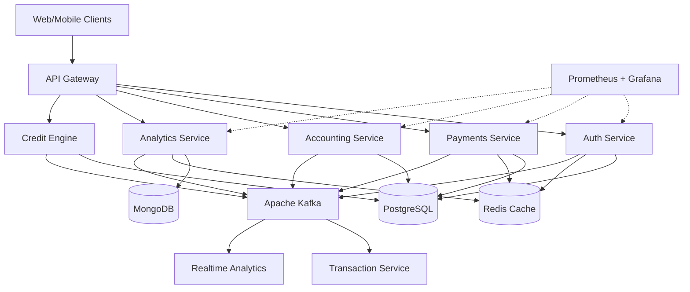
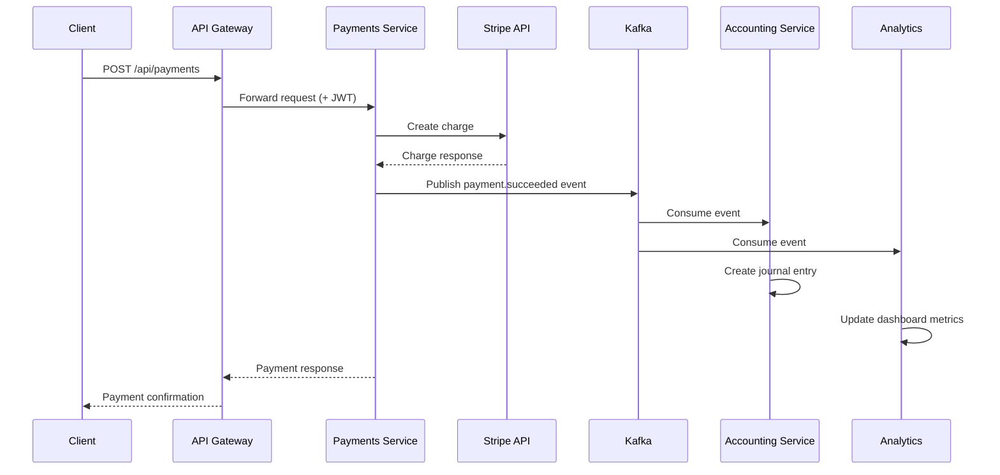
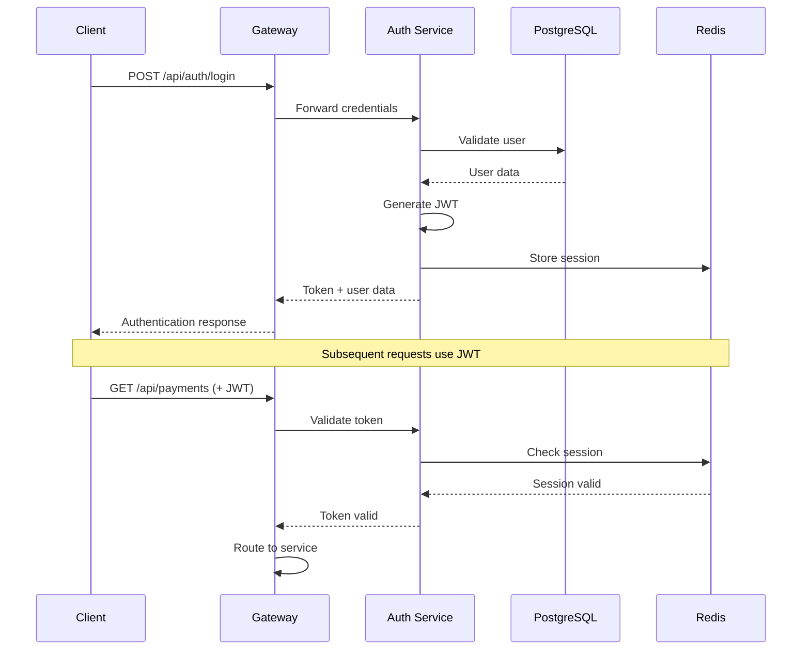

# Architecture Documentation

High-level system architecture, service design, and data flow for FinFlow platform.

---

## Table of Contents

- [Overview](#overview)
- [System Architecture](#system-architecture)
- [Service Architecture](#service-architecture)
- [Data Flow](#data-flow)
- [Technology Stack](#technology-stack)
- [Deployment Architecture](#deployment-architecture)
- [Security Architecture](#security-architecture)

---

## Overview

FinFlow is built on a modern microservices architecture that ensures modularity, scalability, and resilience. The platform uses event-driven communication, polyglot persistence, and cloud-native deployment strategies.

**Key Architectural Principles:**

- **Microservices**: Independent, domain-specific services
- **Event-Driven**: Asynchronous communication via Kafka
- **Polyglot Persistence**: Right database for each use case
- **Cloud-Native**: Container-based deployment with Kubernetes
- **API-First**: RESTful APIs with OpenAPI documentation

---

## System Architecture

### High-Level Architecture Diagram



### Component Overview

| Component               | Purpose                                           | Technology           | Scalability              |
| ----------------------- | ------------------------------------------------- | -------------------- | ------------------------ |
| **API Gateway**         | Request routing, load balancing, rate limiting    | Kong/Nginx           | Horizontal               |
| **Auth Service**        | Authentication, authorization, session management | Node.js + TypeScript | Horizontal               |
| **Payments Service**    | Payment processing and gateway integration        | Node.js + TypeScript | Horizontal               |
| **Accounting Service**  | Double-entry accounting and financial reporting   | Node.js + TypeScript | Horizontal               |
| **Analytics Service**   | Data analysis and visualization                   | Node.js + TypeScript | Horizontal               |
| **Credit Engine**       | ML-based credit scoring                           | Python + FastAPI     | Horizontal               |
| **Transaction Service** | Transaction validation and processing             | Python + FastAPI     | Horizontal               |
| **PostgreSQL**          | Primary relational database                       | PostgreSQL 14+       | Vertical + Read replicas |
| **MongoDB**             | Analytics and time-series data                    | MongoDB 5+           | Sharding                 |
| **Redis**               | Caching and session storage                       | Redis 6+             | Clustering               |
| **Apache Kafka**        | Event streaming and messaging                     | Kafka 3+             | Partitioning             |

---

## Service Architecture

### Service Communication

**Synchronous Communication (REST)**:

- Client → API Gateway → Services
- Used for: User requests, immediate responses
- Protocol: HTTP/HTTPS with JSON

**Asynchronous Communication (Events)**:

- Service → Kafka → Service(s)
- Used for: Background processing, cross-service notifications
- Protocol: Kafka binary protocol

### Module Mapping

**Backend Services (TypeScript/Node.js)**:

```
backend/
├── auth-service/
│   ├── src/
│   │   ├── auth.controller.ts      # HTTP endpoints
│   │   ├── auth.service.ts         # Business logic
│   │   ├── auth.middleware.ts      # JWT validation
│   │   └── models/
│   │       └── user.model.ts       # User entity
│   ├── package.json
│   └── Dockerfile
├── payments-service/
│   ├── src/
│   │   ├── payment.controller.ts
│   │   ├── payment.service.ts
│   │   └── integrations/
│   │       ├── stripe.ts           # Stripe integration
│   │       ├── paypal.ts           # PayPal integration
│   │       └── square.ts           # Square integration
│   └── package.json
└── accounting-service/
    ├── src/
    │   ├── invoice.service.ts
    │   ├── journal-entry.service.ts
    │   └── reports/
    │       ├── balance-sheet.ts
    │       └── income-statement.ts
    └── package.json
```

**Backend Services (Python)**:

```
backend/
├── credit-engine/
│   ├── src/
│   │   ├── main.py                 # FastAPI app
│   │   ├── models.py               # Pydantic models
│   │   └── ml/
│   │       └── credit_model.pkl    # Trained ML model
│   ├── requirements.txt
│   └── Dockerfile
└── transaction-service/
    ├── src/
    │   ├── main.py
    │   ├── validation.py
    │   └── database.py
    └── requirements.txt
```

---

## Data Flow

### Payment Processing Flow



### Authentication Flow



---

## Event-Driven Communication

### Event Types and Flow

| Event Type              | Producer            | Consumers                | Payload                    | Purpose                   |
| ----------------------- | ------------------- | ------------------------ | -------------------------- | ------------------------- |
| `payment.created`       | Payments Service    | Analytics                | Payment ID, amount, status | Track new payments        |
| `payment.succeeded`     | Payments Service    | Accounting, Analytics    | Payment details            | Create accounting entry   |
| `payment.failed`        | Payments Service    | Analytics, Compliance    | Error details              | Track failures            |
| `invoice.created`       | Accounting Service  | Analytics                | Invoice details            | Update metrics            |
| `invoice.paid`          | Accounting Service  | Analytics, Credit Engine | Payment info               | Update cash flow forecast |
| `user.registered`       | Auth Service        | Multi-Tenant, Analytics  | User details               | Initialize tenant         |
| `transaction.processed` | Transaction Service | Accounting, Analytics    | Transaction data           | Update ledger             |
| `credit.scored`         | Credit Engine       | Analytics                | Score, risk level          | Track credit decisions    |

### Kafka Topic Configuration

```yaml
topics:
  - name: payment.events
    partitions: 3
    replication: 3
    retention: 7d

  - name: transaction.events
    partitions: 5
    replication: 3
    retention: 30d

  - name: user.events
    partitions: 2
    replication: 3
    retention: 90d

  - name: analytics.events
    partitions: 10
    replication: 3
    retention: 7d
```

---

## Technology Stack

### Backend Technologies

| Layer             | Technology           | Purpose                  | Justification                             |
| ----------------- | -------------------- | ------------------------ | ----------------------------------------- |
| **API Services**  | Node.js + TypeScript | Core business logic      | High concurrency, strong ecosystem        |
| **ML Services**   | Python + FastAPI     | Machine learning         | Rich ML libraries (scikit-learn, XGBoost) |
| **API Framework** | Express/Fastify      | HTTP routing             | Battle-tested, extensive middleware       |
| **Validation**    | Joi/Zod              | Request validation       | Type-safe validation                      |
| **ORM**           | Prisma/Knex          | Database access          | Type-safe queries                         |
| **Testing**       | Jest/Pytest          | Unit & integration tests | Comprehensive testing frameworks          |

### Data Layer

| Technology       | Use Case                           | Data Type                    | Scaling Strategy                  |
| ---------------- | ---------------------------------- | ---------------------------- | --------------------------------- |
| **PostgreSQL**   | Auth, Payments, Accounting, Credit | Transactional ACID data      | Read replicas, connection pooling |
| **MongoDB**      | Analytics, Logging                 | Time-series, flexible schema | Sharding by date/tenant           |
| **Redis**        | Sessions, Caching                  | Key-value, high-speed        | Redis Cluster for HA              |
| **Apache Kafka** | Event Streaming                    | Message queuing              | Horizontal partitioning           |

### Frontend Technologies

| Component            | Technology              | Purpose                  |
| -------------------- | ----------------------- | ------------------------ |
| **Web Framework**    | React 18 + Vite         | Modern, fast builds      |
| **State Management** | Redux Toolkit           | Centralized state        |
| **UI Components**    | Radix UI + Tailwind CSS | Accessible, customizable |
| **API Client**       | Axios + TanStack Query  | Data fetching, caching   |
| **Mobile Framework** | React Native + Expo     | Cross-platform mobile    |
| **Navigation**       | React Navigation        | Mobile routing           |

---

## Deployment Architecture

### Kubernetes Deployment

```yaml
# Example: Payments Service Deployment
apiVersion: apps/v1
kind: Deployment
metadata:
  name: payments-service
  namespace: finflow-prod
spec:
  replicas: 3
  selector:
    matchLabels:
      app: payments-service
  template:
    spec:
      containers:
        - name: payments-service
          image: finflow/payments-service:v1.2.0
          ports:
            - containerPort: 3002
          env:
            - name: NODE_ENV
              value: "production"
            - name: DATABASE_URL
              valueFrom:
                secretKeyRef:
                  name: payments-db-secret
                  key: connection-string
          resources:
            requests:
              cpu: 500m
              memory: 512Mi
            limits:
              cpu: 1000m
              memory: 1Gi
          livenessProbe:
            httpGet:
              path: /health
              port: 3002
            initialDelaySeconds: 30
            periodSeconds: 10
          readinessProbe:
            httpGet:
              path: /ready
              port: 3002
            initialDelaySeconds: 10
            periodSeconds: 5
---
apiVersion: v1
kind: Service
metadata:
  name: payments-service
spec:
  selector:
    app: payments-service
  ports:
    - port: 80
      targetPort: 3002
  type: ClusterIP
---
apiVersion: autoscaling/v2
kind: HorizontalPodAutoscaler
metadata:
  name: payments-service-hpa
spec:
  scaleTargetRef:
    apiVersion: apps/v1
    kind: Deployment
    name: payments-service
  minReplicas: 2
  maxReplicas: 10
  metrics:
    - type: Resource
      resource:
        name: cpu
        target:
          type: Utilization
          averageUtilization: 70
    - type: Resource
      resource:
        name: memory
        target:
          type: Utilization
          averageUtilization: 80
```

### Infrastructure Layers

```
┌─────────────────────────────────────────────────┐
│          CDN (CloudFront/CloudFlare)            │
└─────────────────────────────────────────────────┘
                      ↓
┌─────────────────────────────────────────────────┐
│        Load Balancer (ALB/NLB)                  │
└─────────────────────────────────────────────────┘
                      ↓
┌─────────────────────────────────────────────────┐
│      Kubernetes Cluster (EKS/GKE/AKS)           │
│  ┌──────────────┐  ┌──────────────┐            │
│  │ API Gateway  │  │  Services    │            │
│  │  (Ingress)   │  │  (Pods)      │            │
│  └──────────────┘  └──────────────┘            │
└─────────────────────────────────────────────────┘
                      ↓
┌─────────────────────────────────────────────────┐
│         Managed Services Layer                  │
│  ┌──────────────┐  ┌──────────────┐            │
│  │  RDS/Aurora  │  │ ElastiCache  │            │
│  │ (PostgreSQL) │  │   (Redis)    │            │
│  └──────────────┘  └──────────────┘            │
│  ┌──────────────┐  ┌──────────────┐            │
│  │ DocumentDB/  │  │  MSK/Kafka   │            │
│  │  MongoDB     │  │  (Streaming) │            │
│  └──────────────┘  └──────────────┘            │
└─────────────────────────────────────────────────┘
                      ↓
┌─────────────────────────────────────────────────┐
│        Observability & Security                 │
│  Prometheus │ Grafana │ ELK │ GuardDuty         │
└─────────────────────────────────────────────────┘
```

---

## Security Architecture

### Security Layers

1. **Network Security**
   - VPC with private subnets
   - Security groups and NACLs
   - WAF for DDoS protection

2. **Application Security**
   - JWT authentication
   - Role-based access control (RBAC)
   - Rate limiting (100 req/min per IP)
   - Input validation

3. **Data Security**
   - Encryption at rest (AES-256)
   - Encryption in transit (TLS 1.3)
   - PII data tokenization
   - Database encryption

4. **Compliance**
   - GDPR compliance (data privacy)
   - PSD2 compliance (payment services)
   - AML/CFT checks (anti-money laundering)
   - SOC 2 compliance

### Authentication & Authorization Flow

```
┌─────────────┐     ┌─────────────┐     ┌─────────────┐
│   Client    │────▶│ API Gateway │────▶│ Auth Service│
│  (Browser)  │     │  (Kong)     │     │   (JWT)     │
└─────────────┘     └─────────────┘     └─────────────┘
       ▲                   │                     │
       │                   │                     ▼
       │                   │            ┌─────────────┐
       │                   │            │   Redis     │
       │                   │            │  (Session)  │
       │                   │            └─────────────┘
       │                   ▼
       │            ┌─────────────┐
       └────────────│  Protected  │
                    │  Services   │
                    └─────────────┘
```

---

## Monitoring Architecture

### Observability Stack

**Metrics Collection:**

- Prometheus scrapes metrics from all services
- Custom metrics via StatsD
- Service health checks every 10s

**Logging:**

- Centralized logging with ELK Stack
- Log levels: DEBUG, INFO, WARN, ERROR
- Structured JSON logs

**Tracing:**

- Distributed tracing with OpenTelemetry
- Request correlation IDs
- Performance bottleneck identification

**Dashboards:**

- Grafana for metrics visualization
- Pre-built dashboards for each service
- Custom alerting rules

---

For deployment instructions, see [INSTALLATION.md](INSTALLATION.md).
For API details, see [API.md](API.md).
For configuration, see [CONFIGURATION.md](CONFIGURATION.md).
