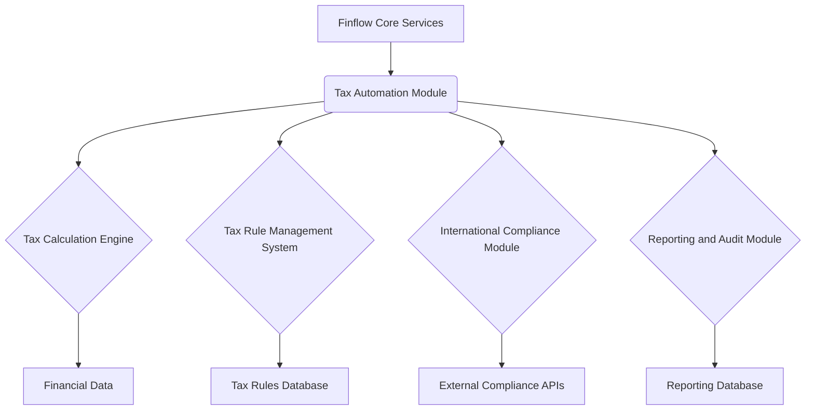

# Tax Automation Architecture Design for Finflow

## Introduction

This document outlines the proposed architecture for integrating advanced tax automation capabilities into the Finflow application. The goal is to provide a robust, scalable, and compliant solution for tax calculation, reporting, and international compliance within the financial industry. This design considers the existing Finflow codebase and aims for seamless integration while adhering to financial industry standards.

## Overall Architecture

The tax automation system will be designed as a modular component within the existing Finflow architecture. It will interact with core Finflow services for financial data, user management, and reporting. The primary components of the tax automation module will include:

1.  **Tax Calculation Engine (TCE):** Responsible for computing various taxes based on financial transactions, user profiles, and applicable tax rules.
2.  **Tax Rule Management System (TRMS):** A mechanism to define, store, and update tax rules, rates, and regulations for different jurisdictions.
3.  **International Compliance Module (ICM):** Handles specific international compliance requirements such as FATCA, KYC/AML, and data residency.
4.  **Reporting and Audit Module (RAM):** Generates tax reports, audit trails, and provides data for regulatory submissions.

### High-Level Diagram

## Data Models

To support tax automation, several new or extended data models will be required:

- **Transaction Data:** Existing financial transaction data will be augmented with tax-relevant fields (e.g., transaction type, origin, destination, product/service codes).
- **Tax Rule Data:** A comprehensive data model to store tax rules, including:
  - `rule_id`: Unique identifier for the tax rule.
  - `jurisdiction`: Country, state, or region to which the rule applies.
  - `tax_type`: (e.g., VAT, Sales Tax, Income Tax, Withholding Tax).
  - `effective_date`: Date from which the rule is active.
  - `expiration_date`: Date when the rule expires (if applicable).
  - `rate`: Tax rate (percentage or fixed amount).
  - `conditions`: Criteria for applying the tax rule (e.g., transaction amount, customer type, product category).
  - `calculation_method`: Logic for applying the tax (e.g., percentage of gross, tiered rates).
- **Tax Profile Data:** User or entity-specific tax information:
  - `entity_id`: Reference to the Finflow user/entity.
  - `tax_identification_number`: (e.g., TIN, VAT ID).
  - `tax_residency`: Country/jurisdiction of tax residency.
  - `exemptions`: Applicable tax exemptions.
- **Compliance Data:** Data related to international compliance checks:
  - `compliance_check_id`: Unique identifier for a compliance check.
  - `check_type`: (e.g., KYC, AML, FATCA).
  - `entity_id`: Reference to the Finflow user/entity.
  - `status`: (e.g., Passed, Failed, Pending).
  - `details`: JSON field for storing specific check results or external API responses.
  - `timestamp`: When the check was performed.

## Integration Points

Integration with existing Finflow components will be crucial for seamless operation:

- **Financial Transaction Processing:** The tax calculation engine will intercept financial transactions to apply relevant taxes before finalization. This could be implemented as a middleware or a service call within the existing transaction flow.
- **User Management:** Tax profile data will be linked to existing user accounts. Updates to user information (e.g., address changes) should trigger a review of applicable tax rules.
- **Reporting Module:** The new Reporting and Audit Module will feed into Finflow's existing reporting infrastructure, providing tax-specific reports and data for dashboards.
- **API Gateway:** External tax rule updates or compliance checks (e.g., real-time VAT rate lookups, FATCA status verification) will be handled via Finflow's API gateway, ensuring secure and authenticated communication.

## Tax Calculation Engine (TCE) Design

The TCE will be the core component for computing taxes. It will be designed to be highly configurable and extensible to accommodate diverse tax regulations globally.

### Key Features:

- **Rule-Based Processing:** The TCE will use a rule engine to apply tax rules dynamically based on transaction attributes and tax profile data.
- **Jurisdiction-Aware:** Capable of handling tax calculations for multiple jurisdictions, applying the correct rules based on the origin and destination of transactions, and the tax residency of involved parties.
- **Tax Type Agnostic:** Designed to calculate various tax types (e.g., sales tax, VAT, income tax, withholding tax, capital gains tax) by abstracting the calculation logic.
- **Historical Data Support:** Ability to apply historical tax rates and rules for past transactions, crucial for amendments and audits.
- **Error Handling and Validation:** Robust mechanisms to identify and flag invalid tax calculations or missing data.

### Calculation Flow:

1.  **Input:** Transaction details (amount, type, parties, location), product/service codes.
2.  **Tax Rule Lookup:** Based on jurisdiction, transaction type, and effective date, retrieve applicable tax rules from the TRMS.
3.  **Condition Evaluation:** Evaluate conditions associated with each rule to determine applicability.
4.  **Rate Application:** Apply the relevant tax rates and calculation methods.
5.  **Output:** Calculated tax amount, breakdown by tax type, and applied rules.

## International Compliance Module (ICM) Design

The ICM will focus on addressing specific international regulatory requirements beyond standard tax calculations. This module will be designed with flexibility to integrate with external compliance services.

### Key Features:

- **FATCA Compliance:**
  - **Identification:** Mechanisms to identify U.S. persons holding financial assets outside the U.S.
  - **Reporting:** Generation of FATCA-specific reports (e.g., Form 8966) for submission to relevant authorities.
  - **Data Exchange:** Secure exchange of information with financial institutions and tax authorities.
- **KYC/AML Procedures:**
  - **Identity Verification:** Integration with third-party identity verification services (e.g., for checking government IDs, sanctions lists).
  - **Transaction Monitoring:** Rules-based system to flag suspicious transactions for review.
  - **Risk Scoring:** Assigning risk scores to customers based on their profile and transaction history.
- **Data Residency Management:**
  - **Data Segregation:** Ensuring that data is stored and processed in the correct geographical regions as per regulatory requirements.
  - **Access Control:** Implementing strict access controls based on data residency rules.
- **PSD2 Compliance (for payment-related services):**
  - **Strong Customer Authentication (SCA):** Implementation of multi-factor authentication for online payments.
  - **Secure Communication:** Ensuring secure communication channels for payment initiation and data exchange.

### Integration with External Services:

- The ICM will leverage external APIs for real-time checks and data validation (e.g., identity verification services, sanctions list databases).
- A robust API wrapper layer will be developed to abstract external service complexities and ensure data security.

## Technology Stack Considerations

Given the existing Finflow stack (Node.js, React, Python for backend services), the new modules will primarily leverage these technologies. For the rule engine, a lightweight, embeddable rule engine library in Python or Node.js will be considered. Database interactions will utilize existing ORM/ODM solutions.

## Security and Compliance

- **Data Encryption:** All sensitive tax and compliance data will be encrypted at rest and in transit.
- **Access Control:** Role-based access control (RBAC) will be strictly enforced to ensure only authorized personnel can access sensitive tax and compliance information.
- **Audit Trails:** Comprehensive audit trails will be maintained for all tax calculations, rule changes, and compliance checks, providing an immutable record for regulatory scrutiny.
- **Regular Updates:** The system will be designed to facilitate regular updates to tax rules and compliance regulations, ensuring ongoing adherence.

## Future Enhancements

- **Machine Learning for Anomaly Detection:** Utilizing ML to identify unusual tax patterns or potential compliance breaches.
- **Predictive Tax Planning:** Leveraging historical data and ML to provide insights for tax optimization.
- **Blockchain for Immutable Records:** Exploring blockchain technology for creating tamper-proof records of tax transactions and compliance events.
